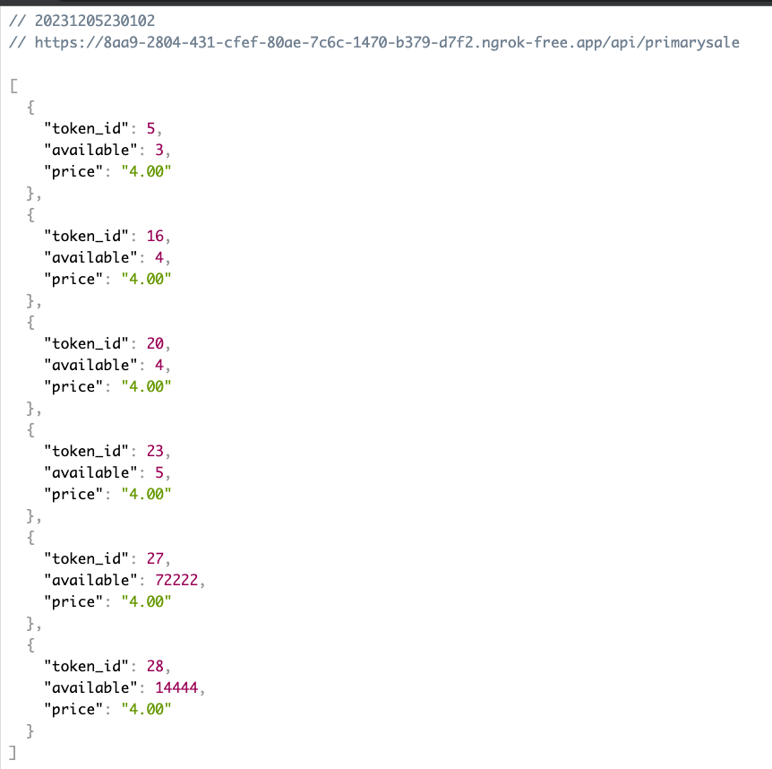
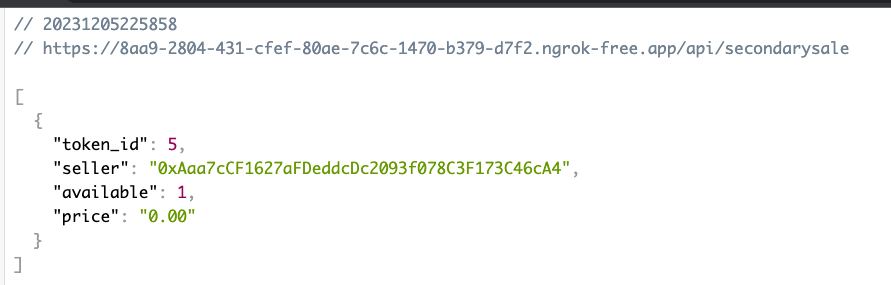
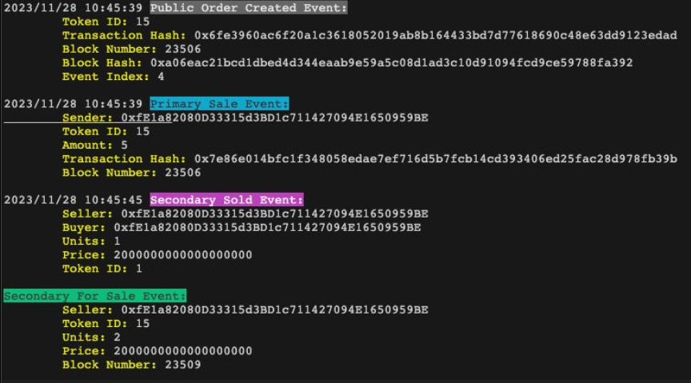

# Blockchain Event Listener in Go 

#### Esse repositório é especifico para um micro-serviço em blockchain que escuta os eventos dos 4 principais eventos dos contratos inteligentes: 

 O Projeto está desenvolvido na arquitetura hexagonal separando o dominio, usecases e repository para cada módulo, a aplicação é configurada no init.go em config onde é configurado os nós e blockchain que vai se conectar, banco de dados Postgrees e endereços de contratos.

> * publicOrderCreated(uint256 indexed _tokenId, uint256 indexed _units, uint256 _price)
> * primarySale(address indexed _sender, uint256 indexed _tokenId, uint256 indexed _amount)
> * secondaryForSale(address indexed _seller, uint256 indexed _tokenId, uint256 indexed _units, uint256 _price)
> * secondarySold(address indexed _seller, address indexed _buyer, uint256 indexed _units, uint256 _price, uint256 _tokenId)
> * treasuryCreated(uint256 indexed tokenId, uint256 indexed _totalValue, uint256 indexed _apy, uint256 _duration, uint8 arg4)
> * Transfer(address indexed from, address indexed to, uint256 value)

#### Cada evento do contrato possui um módulo no projeto para escuta e realizar uma ação sob o evento disparado. No nosso caso ele salva no banco e monta a tabela de venda primmária e venda secundaria. 

-  A tabela de venda primaria é sempre atualizada sempre quando um novo evento de publicOrderCreated é disparado e primarySale atualiza os saldo availables (disponvel)

##### PrimarySale Table

##### Secundary Table
- A tabela de venda secundaria é sempre atualizada quando o evento secondaryForSale é disparado e atualizado quando secondarySold é disparado. 

##### Logs 
- O golang retorna no log toda vez que um evento é disparado: 

> Nesse exemplo mostra os logs quando foi executado todas funções do protocolo.